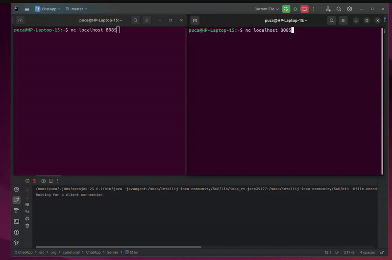

# 💬 Chat Server Project 💬

This is a simple Chat Server project developed in the 5th week of my Java bootcamp. 
The server is responsible for receiving and managing messages from connected clients, enabling real-time communication between multiple users.

# Features:

- Manages multiple client connections
- Real-time communication between connected clients
- Message handling and session management
- Basic logging to monitor connections and sent/received messages
- /name newname: Allows users to change their username
- /kick username: Kicks a specific user from the server
- /quit: Allows users to exit the server

# Project Demo

